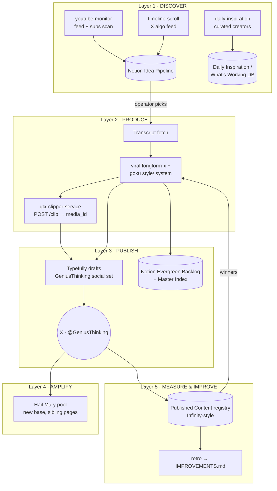

# GeniusThinking Content System — Architecture & Rollout Plan

Design doc. Nothing in here is built or scheduled yet — this is the blueprint to review
before any wiring happens.

The thesis: **every layer of a full content system already exists as a proven, running
component** on the GeniusGTX / health-fleet side. GeniusThinking is not a greenfield build;
it is a *configuration* of four existing engines plus four existing discovery skills.
The work is wiring, not invention.

---

## 1. The assets (what already exists)

| Asset | What it does | State |
|---|---|---|
| **Discovery skills** (`youtube-monitor`, `timeline-scroll`, `daily-inspiration`) | Browser-driven scans: YouTube home feed + subscriptions, X algorithmic timeline, curated creator watchlist. Score candidates (7-point qualitative filter + view thresholds), dedupe, write to the Notion **Idea Pipeline** (`collection://330aef7b-3feb-401e-abba-28452441a64d`) and **Daily Inspiration** DB. | Written, runnable as scheduled tasks |
| **`viral-longform-x`** skill | Transcript → 30 ranked topics → 10 narrow-format hooks → 3–5 longform bodies → AI-tell + fabrication audit → attribution. Niche-agnostic via brand profiles; a GeniusGTX profile already exists (`examples/brand-config-geniusgtx.md`). | Written, includes calibration examples |
| **goku-extraction-pipeline** (this repo) | Long interview + transcript → 5–10 strict-format posts → clip per post → Notion Evergreen Backlog + Typefully drafts, cross-linked, Master Index updated. The `style/` folder is the canonical format system. | v0.1, works end-to-end on the GTX setup |
| **gtx-clipper-service** | Cloud clipper: YouTube URL + timestamps → remote-seek ffmpeg → 1080p mp4 → Typefully media upload + race-safe draft attach. Removes the local yt-dlp/ffmpeg dependency. | Verified contracts 2026-07-02, Railway-ready |
| **Project Hail Mary** | Fleet growth engine: scout viral posts → human approve → caption variants → schedule across N pages with dup-flag guards. Stateless and base-parameterized — a new vertical is one duplicated Airtable base + `apply-fleet.mjs`. | Live on the AI base, 134 tests passing |
| **project-infinity** | Monetization + measurement loop: recreation engine, per-post registry with revenue attribution, QC gates, link sentinel, self-improvement retro. An account is a config block. | Live on the health fleet |

---

## 2. Target architecture (five layers)

### Layer 1 — Discover (the idea pipeline)

Three funnels, one sink. All three skills already write to the same Notion Idea Pipeline
with the same schema (Idea, Source Type, Source URL, Urgency 🔴/🟡/🟢, 7-point score,
Content Angle, Notes) and already implement cross-funnel convergence (same story from two
funnels → urgency upgraded one tier).

- `youtube-monitor` — feed-first scan on the Genius Thinking YouTube account; duration
  filter 5–40 min tuned for the clipper; 6–10 qualifying ideas per scan.
- `timeline-scroll` — X algorithmic feed on @GeniusGTX_2, with algorithm training
  (like approved / "not interested" rejected) so the feed compounds.
- `daily-inspiration` — curated creator watchlist → 300K+ threads logged with full hook
  anatomy (hook structure template, engagement ratios, format breakdown). This is the
  *pattern library* the production layer draws hooks from.

**Cadence (proposed):** youtube-monitor 2×/day, timeline-scroll 2×/day,
daily-inspiration 1×/day. Human gate stays: ideas land as `Status: New`; the operator
flips keepers to approved — same single-gate philosophy as Hail Mary's Backlog.

### Layer 2 — Produce

Input: an approved Idea Pipeline row (YouTube URL + key timestamps, or an X post to
respond to). Two production paths share one style system:

1. **Text-first (longform post):** `viral-longform-x` 4-stage pipeline with a
  **GeniusThinking brand profile** (see §4, Decision 1). Non-negotiables carried over:
  narrow hook format (`[Name] says [shocking claim]`, 14–17 words), Rule of One,
  fabrication check against the transcript, sentence-rhythm audit, verified attribution.
2. **Clip-first (post + native video):** the goku pipeline Phase 1/Phase 2 protocol —
  ideation tiers, strict style checklist, clip cue selection (standalone-hook rule) —
  but **clip cutting moves from local `extract_clip.sh` to gtx-clipper-service** so the
  whole path runs cloud-side with no operator machine involved. One RapidAPI lookup per
  video (4h cache) covers all clips from that source.

Transcript acquisition is the one genuinely new piece (see §5, Gap 1).

### Layer 3 — Publish

- **Typefully is the spine** (same as every existing system): drafts created on the
  GeniusThinking social set, media attached via the clipper's race-safe `/attach`
  (fetch draft → re-send own text + media_ids — never a blind PATCH).
- **Notion is the record**: Evergreen Backlog sub-item per post (`Adding Media` →
  `Ready to Post`), cross-linked to the Typefully draft, Master Index bullet appended.
- Scheduling starts **operator-driven** (eyeball drafts, then let them fire), moving to
  fixed premium slots per day once QC confidence is earned — the same progression
  Infinity followed before its 9pm-slot automation.

### Layer 4 — Amplify (phase 2 — do not build first)

A **new Hail Mary pool**: duplicate the template base per `schema.json`, register it in
`fleet.json` + `HAILMARY_BASES`, seed Sources with GeniusThinking-adjacent creators, add
sibling pages. Zero engine changes — this is exactly the "add a new niche" operation the
Hail Mary README documents. The grown pages RT/QRT the main account (the Infinity RT-bridge
pattern) and are themselves sellable reach later.

### Layer 5 — Measure & improve (phase 2–3)

- **Registry**: one row per published post, Infinity-style — Typefully analytics joined to
  the draft, Winner / Repost Candidate auto-flags. Lives in its own private base, never in
  a swipe/idea base (Infinity's separation rule).
- **Monetization**: GeniusThinking is not health-affiliate; revenue rails are TBD
  (see §4, Decision 4). The registry schema should carry `subid`-style attribution columns
  from day one even if they start empty — retrofitting attribution is what under-counted
  Infinity's early threads.
- **Retro**: after the loop runs, adopt Infinity's discipline — one evidence-grounded
  improvement per run into an `IMPROVEMENTS.md`, root-cause fixes only (prompt/checklist,
  not per-draft patches).

---

## 3. Rollout plan

Ordered so each phase ships something usable alone. Estimates assume the connectors
(Typefully, Notion, Airtable, n8n) stay authorized as they are in this session.

| Phase | Deliverable | Effort | Done when |
|---|---|---|---|
| **0. Config foundations** | GeniusThinking brand profile for `viral-longform-x`; confirm Typefully social set + Notion DB IDs; clipper deployed on Railway with its own `SERVICE_KEY` | ~half a day | `POST /health` green; brand profile committed |
| **1. Production path, manual trigger** | Approved idea → posts drafted (audited) → clips cut cloud-side → Typefully drafts + Notion cards, cross-linked | 1–2 days | One idea flows end-to-end with zero local tooling |
| **2. Discovery on schedule** | The three scan skills running as scheduled tasks, feeding the Idea Pipeline; convergence upgrades working | ~1 day | 6–10 fresh scored ideas/day arriving unattended |
| **3. Publishing cadence** | Fixed daily slots; QC checklist gate before anything schedules (adapt Infinity `checks.mjs` philosophy: deterministic gates, then LLM QC as backstop) | 1–2 days | A week of posts ships with zero structural defects |
| **4. Amplification pool** | Hail Mary base for GeniusThinking vertical, 3–5 sibling pages, sources seeded | ~1 day + page warm-up time | `apply-fleet.mjs --apply` clean; scout filling the backlog |
| **5. Registry + retro** | Published Content registry, winner flags, repost loop, IMPROVEMENTS.md | 1–2 days | First winner auto-flagged and recreated |

Phase 1 is the keystone: it proves the whole production spine before anything runs
unattended. Phases 4 and 5 are deliberately last — Infinity's GOALS.md discipline applies:
don't scale distribution before the content path is verified, don't scale untracked.

---

## 4. Open decisions (operator input needed)

1. **Brand identity.** Is GeniusThinking (a) the existing @GeniusGTX account under a new
   system, (b) the @GeniusGTX_2 account graduating to primary, or (c) a genuinely new
   handle? This decides the Typefully social set, the brand profile voice, and whether
   Layer 4 amplifies an account with 278k followers or warms a new one.
2. **Content mix.** Ratio of clip-first (Goku video posts) vs text-first (longform) vs
   repost-style (Hail Mary captions on the main account). Proposal: start 2 clip posts +
   1 longform per day, adjust on data.
3. **Existing vs new Notion databases.** Reuse the live Idea Pipeline + Evergreen Backlog
   (fastest, shared with GTX workflows) or duplicate them for a clean GeniusThinking
   workspace (cleaner attribution, more setup). Proposal: reuse — the Source/Notes fields
   already distinguish funnels.
4. **Monetization rails.** GTX-style (ebook/Gumroad + affiliate where it fits) or
   audience-first with monetization deferred to phase 5? This only blocks Phase 5, not 1–4.
5. **Scheduling runtime.** GitHub Actions crons (Infinity's pattern — versioned, free,
   observable) vs n8n (already the data-ingestion layer) vs Claude scheduled tasks (the
   discovery skills assume this). Proposal: discovery = scheduled Claude tasks (they need
   a browser), everything deterministic = GitHub Actions, n8n only where it already owns
   a flow.

---

## 5. Known gaps & risks

1. **Transcript acquisition** (Gap — Phase 1). The goku pipeline assumes a transcript is
   handed in. Cloud path needs one: YouTube caption pull via the same RapidAPI vendor, or
   whisper on the clipper service (already listed as its roadmap item). Decision inside
   Phase 1.
2. **Duplicate-content enforcement.** X's 2026 enforcement is why Hail Mary has four
   guards (caption variation, fan-out cap, stagger, cooldown). Any GeniusThinking
   amplification must run through those same `checks.mjs` guards — never raw re-uploads.
3. **Rights & attribution.** Every clip is someone else's footage. Carry the Infinity
   rule: source handle + URL travel with every artifact; attribution is part of the post
   format (the goku closer template already ends with attribution), rights check before
   publishing.
4. **Typefully race condition.** UI edits between media PUT and final PATCH strip
   media_ids. The clipper's `/attach` is the fix; the "don't touch pending drafts" lockout
   warning stays in every operator-facing flow.
5. **Silent failures.** Adopt Infinity's alert philosophy from day one: jobs say nothing
   unless a human is needed; every cron registered with a failure handler; heartbeats on
   a dashboard, not FYI spam.

---

## 6. What this doc is not

- Not a commitment to build all five layers at once — Phase 1 alone is a working system.
- Not a new engine: if a step needs code that doesn't exist in one of the four repos,
  the default answer is "configure the existing engine differently," per the
  account-is-a-config-block principle.
