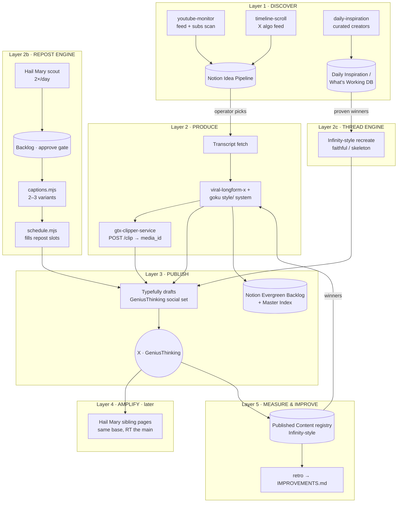

# GeniusThinking Content System — Architecture & Rollout Plan

Design doc. Nothing in here is built or scheduled yet — this is the blueprint to review
before any wiring happens.

The thesis: **every layer of a full content system already exists as a proven, running
component** on the GeniusGTX / health-fleet side. GeniusThinking is not a greenfield build;
it is a *configuration* of four existing engines plus four existing discovery skills.
The work is wiring, not invention.

**The account model (confirmed by operator, 2026-07-27):** GeniusThinking is ONE account
running THREE content engines side by side:

1. **Reposts** — proven viral tweets from other accounts, via Project Hail Mary.
   GeniusThinking is registered as a **Page in a Hail Mary base**; the existing
   scout → approve → caption-variant → schedule engine supplies baseline daily volume
   and follower growth, with all four dup-flag guards.
2. **Our longform** — original posts from transcripts (goku clip posts + viral-longform-x
   text posts), the premium content that differentiates the account.
3. **Viral thread pipeline** — proven winning threads recreated in our voice,
   Infinity-style (`recreate.mjs` pattern), fed by the daily-inspiration / What's Working
   swipe data.

Hail Mary carries the volume; longform and threads carry the identity. The design below
is organized around making the three engines share one account without colliding.

---

## 1. The assets (what already exists)

| Asset | What it does | State |
|---|---|---|
| **Discovery skills** (`youtube-monitor`, `timeline-scroll`, `daily-inspiration`) | Browser-driven scans: YouTube home feed + subscriptions, X algorithmic timeline, curated creator watchlist. Score candidates (7-point qualitative filter + view thresholds), dedupe, write to the Notion **Idea Pipeline** (`collection://330aef7b-3feb-401e-abba-28452441a64d`) and **Daily Inspiration** DB. | Written, runnable as scheduled tasks |
| **`viral-longform-x`** skill | Transcript → 30 ranked topics → 10 narrow-format hooks → 3–5 longform bodies → AI-tell + fabrication audit → attribution. Niche-agnostic via brand profiles; a GeniusGTX profile already exists (`examples/brand-config-geniusgtx.md`). | Written, includes calibration examples |
| **goku-extraction-pipeline** (this repo) | Long interview + transcript → 5–10 strict-format posts → clip per post → Notion Evergreen Backlog + Typefully drafts, cross-linked, Master Index updated. The `style/` folder is the canonical format system. | v0.1, works end-to-end on the GTX setup |
| **gtx-clipper-service** | Cloud clipper: YouTube URL + timestamps → remote-seek ffmpeg → 1080p mp4 → Typefully media upload + race-safe draft attach. Removes the local yt-dlp/ffmpeg dependency. | Verified contracts 2026-07-02, Railway-ready |
| **Project Hail Mary** | Fleet growth engine: scout viral posts → human approve → caption variants → schedule across N pages with dup-flag guards. Stateless and base-parameterized — a new vertical is one duplicated Airtable base + `apply-fleet.mjs`. | Live on the AI base, 134 tests passing |
| **project-infinity** | Monetization + measurement loop: recreation engine, per-post registry with revenue attribution, QC gates, link sentinel, self-improvement retro. An account is a config block. | Live on the health fleet |

---

## 2. Target architecture (five layers)

### Layer 1 — Discover (the idea pipeline)

Three funnels, one sink. All three skills already write to the same Notion Idea Pipeline
with the same schema (Idea, Source Type, Source URL, Urgency 🔴/🟡/🟢, 7-point score,
Content Angle, Notes) and already implement cross-funnel convergence (same story from two
funnels → urgency upgraded one tier).

- `youtube-monitor` — feed-first scan on the Genius Thinking YouTube account; duration
  filter 5–40 min tuned for the clipper; 6–10 qualifying ideas per scan.
- `timeline-scroll` — X algorithmic feed on @GeniusGTX_2, with algorithm training
  (like approved / "not interested" rejected) so the feed compounds.
- `daily-inspiration` — curated creator watchlist → 300K+ threads logged with full hook
  anatomy (hook structure template, engagement ratios, format breakdown). This is the
  *pattern library* the production layer draws hooks from.

**Cadence (proposed):** youtube-monitor 2×/day, timeline-scroll 2×/day,
daily-inspiration 1×/day. Human gate stays: ideas land as `Status: New`; the operator
flips keepers to approved — same single-gate philosophy as Hail Mary's Backlog.

### Layer 2 — Produce

Input: an approved Idea Pipeline row (YouTube URL + key timestamps, or an X post to
respond to). Two production paths share one style system:

1. **Text-first (longform post):** `viral-longform-x` 4-stage pipeline with a
  **GeniusThinking brand profile** (see §4, Decision 1). Non-negotiables carried over:
  narrow hook format (`[Name] says [shocking claim]`, 14–17 words), Rule of One,
  fabrication check against the transcript, sentence-rhythm audit, verified attribution.
2. **Clip-first (post + native video):** the goku pipeline Phase 1/Phase 2 protocol —
  ideation tiers, strict style checklist, clip cue selection (standalone-hook rule) —
  but **clip cutting moves from local `extract_clip.sh` to gtx-clipper-service** so the
  whole path runs cloud-side with no operator machine involved. One RapidAPI lookup per
  video (4h cache) covers all clips from that source.

Transcript acquisition is the one genuinely new piece (see §5, Gap 1).

### Layer 2b — Repost engine (Hail Mary)

GeniusThinking becomes a **Page row** in a Hail Mary base — either a new
"GeniusThinking" pool (own Sources + Backlog, seeded via `apply-fleet.mjs`) or a pool in
an existing base if the niche overlaps (see §4, Decision 3). Everything is the stock
engine, zero code changes:

- **Scout** monitors GeniusThinking-adjacent Sources (the daily-inspiration watchlist is
  the natural seed list) + the niche sweep; operator approves keepers in the Backlog.
- **Captions** writes 2–3 rewrite variants per approved original (5-gram similarity gate,
  banned-phrase list, niche relabeling).
- **Schedule** fills the page's `Posts per day` repost slots, rotates variants, appends
  the follow-CTA, QRTs the page's own prior posts (`qrt_share`) for bonus reach.
- All four dup-flag guards apply (variation, fan-out cap, stagger, per-page cooldown).

### Layer 2c — Thread engine (Infinity pattern)

Proven winning threads → recreated in the GeniusThinking voice. The daily-inspiration /
What's Working DB is exactly Infinity's swipe input: full verbatim hooks, hook-structure
templates, engagement ratios, format anatomy. Recreation follows the two Infinity modes
(faithful ~85% reword, or skeleton-variation: keep the viral FORM, new substance), with
deterministic gates before any write. This engine starts manual-per-thread and only goes
on cron after the QC gate exists (Phase 5).

### Slot coordination (the one real integration point)

Three engines writing to one Typefully social set must not collide. Infinity already
solved this shape — its Harvest engine "schedules its own variations into reserved slots
independently" while daily-winners owns the 9pm slot. Same rule here, **directional by
slot ownership**:

- **Reposts** = Hail Mary's `Posts per day` capacity, filling next-free-slot as designed.
- **Threads** = one reserved premium slot per day (Infinity's 9pm-Saigon precedent).
- **Longform/clips** = 1–2 reserved slots, operator-scheduled at first.
- The `daily_dispatch_cap` config remains the fleet-wide backstop, and the Hail Mary
  scheduler must treat reserved slots as booked (existing bookings already eat capacity
  in its slot-filling pass, so this is config, not code).

### Layer 3 — Publish

- **Typefully is the spine** (same as every existing system): drafts created on the
  GeniusThinking social set, media attached via the clipper's race-safe `/attach`
  (fetch draft → re-send own text + media_ids — never a blind PATCH).
- **Notion is the record**: Evergreen Backlog sub-item per post (`Adding Media` →
  `Ready to Post`), cross-linked to the Typefully draft, Master Index bullet appended.
- Scheduling starts **operator-driven** (eyeball drafts, then let them fire), moving to
  fixed premium slots per day once QC confidence is earned — the same progression
  Infinity followed before its 9pm-slot automation.

### Layer 4 — Amplify (later phase — do not build first)

Once the GeniusThinking pool exists (Layer 2b), adding **sibling pages** is one
`pages` entry in `fleet.json` + `apply-fleet.mjs --apply` each — shared Backlog, fan-out
guard spreading each winner across handles. The grown pages RT/QRT the main account (the
Infinity RT-bridge pattern) and are themselves sellable reach later.

### Layer 5 — Measure & improve (phase 2–3)

- **Registry**: one row per published post, Infinity-style — Typefully analytics joined to
  the draft, Winner / Repost Candidate auto-flags. Lives in its own private base, never in
  a swipe/idea base (Infinity's separation rule).
- **Monetization**: GeniusThinking is not health-affiliate; revenue rails are TBD
  (see §4, Decision 4). The registry schema should carry `subid`-style attribution columns
  from day one even if they start empty — retrofitting attribution is what under-counted
  Infinity's early threads.
- **Retro**: after the loop runs, adopt Infinity's discipline — one evidence-grounded
  improvement per run into an `IMPROVEMENTS.md`, root-cause fixes only (prompt/checklist,
  not per-draft patches).

---

## 3. Rollout plan

Ordered so each phase ships something usable alone. Estimates assume the connectors
(Typefully, Notion, Airtable, n8n) stay authorized as they are in this session.

| Phase | Deliverable | Effort | Done when |
|---|---|---|---|
| **0. Config foundations** | GeniusThinking brand profile for `viral-longform-x`; confirm Typefully social set + Notion DB IDs; clipper deployed on Railway with its own `SERVICE_KEY` | ~half a day | `POST /health` green; brand profile committed |
| **1. Repost engine live** | GeniusThinking pool + Page in Hail Mary (`apply-fleet.mjs`), Sources seeded from the daily-inspiration watchlist, scout/captions/schedule on the existing crons | ~1 day (data + config only) | Reposts flowing daily through the approve gate; follower tracking on |
| **2. Longform path, manual trigger** | Approved idea → posts drafted (audited) → clips cut cloud-side → Typefully drafts + Notion cards, cross-linked | 1–2 days | One idea flows end-to-end with zero local tooling |
| **3. Discovery on schedule** | The three scan skills running as scheduled tasks, feeding the Idea Pipeline; convergence upgrades working | ~1 day | 6–10 fresh scored ideas/day arriving unattended |
| **4. Thread engine + cadence** | Thread recreation from What's Working winners into the reserved premium slot; QC checklist gate before anything schedules (Infinity `checks.mjs` philosophy: deterministic gates, then LLM QC backstop) | 1–2 days | A week of mixed posts ships with zero structural defects |
| **5. Registry + retro** | Published Content registry, winner flags, repost loop, IMPROVEMENTS.md; sibling amplification pages when growth data supports it | 1–2 days | First winner auto-flagged and recreated |

Phase 1 first because it is pure configuration of a proven engine — the account starts
growing while the original-content path is built. Phase 2 is the keystone for identity:
it proves the production spine before anything original runs unattended. Registry and
sibling pages are deliberately last — Infinity's GOALS.md discipline applies: don't scale
distribution before the content path is verified, don't scale untracked.

---

## 4. Decisions (operator-resolved 2026-07-27 unless marked open)

1. **Handle: @GeniusGTX** ✅. The repost engine rides the 278k-follower main account.
   Operational catch: the default Typefully workspace key sees GeniusGTX_2
   ("Genius Thinking", social set 151393) but **not @GeniusGTX** — the pool's Config
   needs the `typefully_api_key` of the workspace that owns @GeniusGTX, plus its real
   social set id, before the page activates.
2. **New Hail Mary pool** ✅ ("it is going to be a lot"). Own base, own Sources/Backlog.
   The concrete pool spec is committed in Project-Hail-Mary's `fleet.example.json`
   (GeniusThinking pool): 7 curated sources — @readswithravi, @PeakThinkers_, @cptdankkk,
   @r0ck3t23, @Kekius_Sage, @bluewmist, @Jayyanginspires — one page (@GeniusGTX,
   niche `Other` = wildcard over the curated pool), `Active: false` until keys land.
3. **Everything is paraphrased** ✅ — both short tweets AND longform reposts are briefly
   rewritten, never raw re-uploads. This is exactly `captions.mjs`; the one adjustment is
   `rewrite_max_chars` raised per-pool (260 → ~2200, a live Config key, no code change)
   so longform originals can be paraphrased at full length. All similarity gates
   (no 5-word run shared with the original or sibling variants) still apply.
4. **Existing vs new Notion databases** (open). Proposal stands: reuse the live Idea
   Pipeline + Evergreen Backlog — Source/Notes fields already distinguish funnels.
5. **Monetization rails** (open). Only blocks Phase 5, not 1–4. Scheduling runtime is
   settled: discovery = scheduled Claude tasks (browser needed), deterministic jobs =
   GitHub Actions, n8n only where it already owns a flow.

**Starting slot budget** (adjust on data): 5 reposts (Hail Mary `Posts per day`) +
1 thread (reserved premium slot) + 1 longform/clip (reserved) per day.

---

## 5. Known gaps & risks

1. **Transcript acquisition** (Gap — Phase 1). The goku pipeline assumes a transcript is
   handed in. Cloud path needs one: YouTube caption pull via the same RapidAPI vendor, or
   whisper on the clipper service (already listed as its roadmap item). Decision inside
   Phase 1.
2. **Duplicate-content enforcement.** X's 2026 enforcement is why Hail Mary has four
   guards (caption variation, fan-out cap, stagger, cooldown). Any GeniusThinking
   amplification must run through those same `checks.mjs` guards — never raw re-uploads.
3. **Rights & attribution.** Every clip is someone else's footage. Carry the Infinity
   rule: source handle + URL travel with every artifact; attribution is part of the post
   format (the goku closer template already ends with attribution), rights check before
   publishing.
4. **Typefully race condition.** UI edits between media PUT and final PATCH strip
   media_ids. The clipper's `/attach` is the fix; the "don't touch pending drafts" lockout
   warning stays in every operator-facing flow.
5. **Silent failures.** Adopt Infinity's alert philosophy from day one: jobs say nothing
   unless a human is needed; every cron registered with a failure handler; heartbeats on
   a dashboard, not FYI spam.

---

## 6. What this doc is not

- Not a commitment to build all five layers at once — Phase 1 alone is a working system.
- Not a new engine: if a step needs code that doesn't exist in one of the four repos,
  the default answer is "configure the existing engine differently," per the
  account-is-a-config-block principle.
